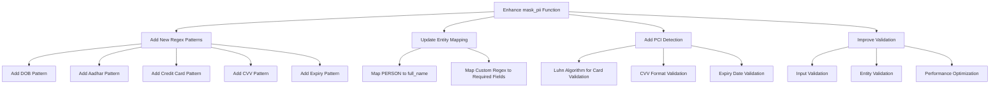

# PII/PCI Data Masking Implementation Plan

## Overview
Before processing any email, all personally identifiable information (PII) and Payment Card Industry (PCI) data must be masked according to specific requirements. This document outlines the implementation plan.

## Required Entity Fields
- Full Name ("full_name")
- Email Address ("email")
- Phone number ("phone_number")
- Date of birth ("dob")
- Aadhar card number ("aadhar_num")
- Credit/Debit Card Number ("credit_debit_no")
- CVV number ("cvv_no")
- Card expiry number ("expiry_no")

## Implementation Plan



### 1. Update Regex Patterns
```python
PATTERNS = {
    'full_name': r'\b[A-Z][a-z]+ (?:[A-Z][a-z]+ )?[A-Z][a-z]+\b',
    'email': EMAIL_PATTERN,
    'phone_number': PHONE_PATTERN,
    'dob': r'\b\d{2}[-/]\d{2}[-/]\d{4}\b',
    'aadhar_num': r'\b\d{4}\s?\d{4}\s?\d{4}\b',
    'credit_debit_no': r'\b\d{4}[-\s]?\d{4}[-\s]?\d{4}[-\s]?\d{4}\b',
    'cvv_no': r'\b\d{3,4}\b',
    'expiry_no': r'\b(0[1-9]|1[0-2])/?([0-9]{2})\b'
}
```

### 2. Enhanced Entity Detection
- Map spaCy's PERSON entity to 'full_name'
- Use custom regex patterns for other entities
- Implement proper card number validation using Luhn algorithm
- Add validation for CVV and expiry date formats

### 3. Masking Strategy
- Replace PII with standardized format: `[ENTITY_TYPE]`
- For PCI data:
  - Credit card: Show only last 4 digits
  - CVV: Complete masking
  - Expiry: Complete masking

### 4. Validation & Error Handling
- Input validation for text
- Entity validation before masking
- Performance optimization for large texts

### 5. Testing Plan
- Unit tests for each entity type
- Integration tests with email processing
- Performance tests with large datasets
- Edge cases and error handling